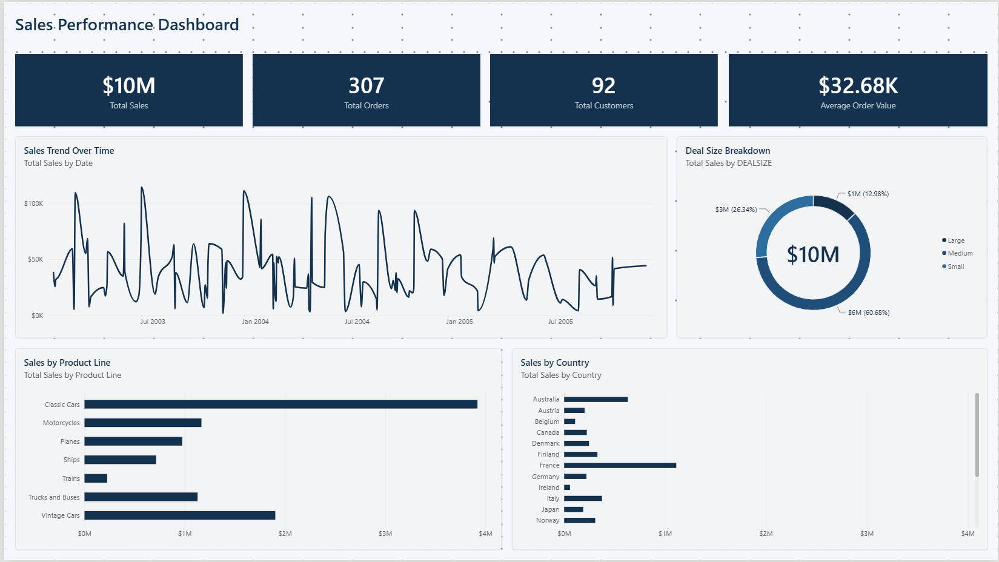

# 📊 AI-Built Power BI Sales Dashboard

An end-to-end Power BI sales performance dashboard built using natural language prompts with Claude Code, rather than manual point-and-click report building.

---

## 🚀 What It Does

- ✅ Connects an AI coding agent directly to a live Power BI Desktop session
- ✅ Builds the full semantic model (tables, relationships, DAX measures) from a raw CSV via natural language
- ✅ Generates report pages and visuals (PBIR format) the same way, no manual dragging fields onto a canvas
- ✅ Applies a custom corporate theme and validates the report structure automatically
- ✅ Produces a 4-page interactive dashboard: Overview, Product & Deal Size, Geography, Trends & Time Intelligence

---

## 🖼️ Dashboard Preview

---

## 💡 The Problem It Solves

Building a Power BI dashboard normally takes hours of manual model building, DAX writing, and visual placement. This project demonstrates using an AI agent (Claude Code) connected to Power BI's semantic model and report format to go from a raw CSV to a finished, themed dashboard through conversation instead of manual UI work.

---

## 🛠️ Technologies Used

| Technology | Purpose |
|---|---|
| Power BI Desktop | Semantic model + report canvas |
| Claude Code | AI agent driving the build via natural language |
| pbi-cli-tool | Exposes Power BI's TMDL model and PBIR report format to Claude Code |
| PBIP (Power BI Project) | Text-based project format enabling AI-driven, version-controlled edits |

---

## 📋 How It Works

1. **Connect** — Claude Code connects live to a running Power BI Desktop session via pbi-cli.
2. **Build the model** — Tables, relationships, and DAX measures are generated from the raw CSV based on a natural language description of the desired dashboard.
3. **Build the report** — Report pages and visuals are generated as PBIR JSON, including layout and chart selection.
4. **Theme & validate** — A custom corporate theme is applied, and the project is validated against Power BI's schema before final review.

---

## 📄 Report

A full analysis write-up (methodology + key findings) is included: [Sales_Performance_Analysis_Report.pdf](Sales_Performance_Analysis_Report.pdf)

---

## ⚙️ Setup & Installation

1. **Clone the repository**

    git clone https://github.com/tinosval/powerbi-ai-dashboard.git
    cd powerbi-ai-dashboard

2. **Open the project**

    Open SalesDashboard.pbip in Power BI Desktop.

3. **Optional: rebuild with Claude Code**

    Install Claude Code and pbi-cli-tool, then connect to a running Power BI Desktop session to modify or extend the model and report via natural language.